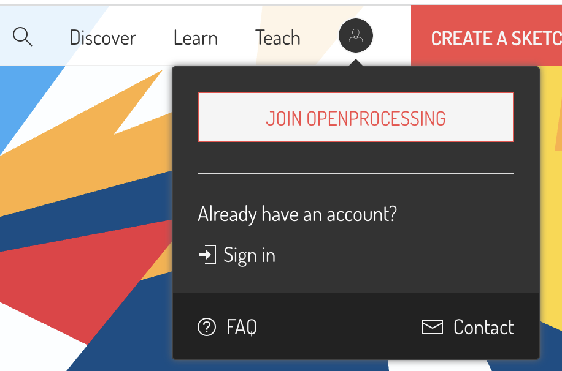

# Setup

To start with this course, we are going to use an easy-to-use environment
available through any browser on any computer. So for now, we do not need
to install anything special.

## Create your account

> ✍️ Go to your favourite browser, and surf to [https://openprocessing.org](https://openprocessing.org).

To save your coding master pieces, you'll have to create an account.

> ✍️ Go to the join button at the top of the page to create your account:

## Create your first sketch

> ✍️ In the top right corner of the page click on "Create a sketch".

You will see a blank page with some first code inside. Don't worry about understanding it for now.

> ✍️ Let's try it out! At the top of the page, click on the ▶ button and marvel at what this little piece of code does.

To go back to the code click on the **</>** button.

## It's a kinda magic?

With only a few lines of code we're doing already something quite interesting. That is because in this environment we can use `p5.js`.

Don't ask me what this name stands for (well, the `.js` stands for `JavaScript`), just know that this is a *library* (a bunch of code) that somebody has written and that we are going to use.

It means that in this tutorial we can use functions to draw circles, rectangles, and much more advanced stuff.

These functions are not a part of JavaScript itself, but that doesn'et matter. They allow us to do some visual stuff easily and focus ourselves on the main programming logic, without having to bother with actually knowing how to draw a circle on the screen (for now).
