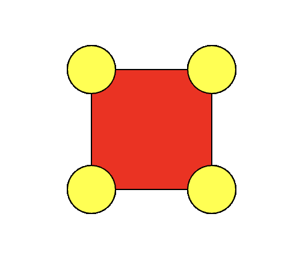

# Introduction

Let's do some first explorations.

## Basic program structure

> ✍️ Take a look at the program structure.

You will see two so-called *function* definitions. We'll talk about those later.

The first one sets up a blank canvas for us to work on.

The real magic happens inside the second function. It only has one line:

```js
circle(mouseX, mouseY, 20);
```

You can probably guess what it does, but let's try to understand it a bit better.

To do so you can always look at the documentation. Or often easier, just experiment, trial-and-error. Let's do that in the next section.

## We are using our first *function*

> ✍️ Let's change the line into this:

```js
function draw() {
  circle(300, 300, 20);
}
```

Somebody has written some code and wrapped it inside a *function* `circle` that we can use by *calling* it.

Between the parentheses, you see three so-called *arguments*.

And finally, the line ends with a semi-colon. In JavaScript, we end our coding lines with a semi-colon, otherwise the JavaScript interpreter continues reading the next line, thinking all of it is just one instruction. The semi-colon is important, and you'll find out, because you'll forget it often. 🙂 Sometimes your code will still work. Sometimes it won't.

## Let's experiment

Have a look at the three arguments: `300, 300, 20`. What do you think they could do?

> ✍️ Try changing them one by one to other values, and see what they exactly do.

## Let's add some color

> ✍️ Change the code to this and see what happens:

```js
function draw() {
  fill("yellow")
  circle(300, 300, 20);
}
```

> ✍️ Try to add an extra circle in another colour now.

## A first little challenge

> ✍️ Try drawing something like this:



(In this example, the square has a size of 100, and the circles have a diameter of 40.)

You'll need to draw a rectangle. What function would you need for that? Think about it, and give it a try...

<details>
<summary><strong>Hint?</strong> Click here</summary>

Well, for a circle we used `circle` ... so ... for a rectangle we'd use ...?
</details>

<br/>

<details>
<summary><strong>Didn't work?</strong> Click here</summary>

Just like me, you probably tried `rectangle()`, ... and failed. Turns out, programmers are lazy. They don't like to type a lot, so they make abbrevations. Try `rect()` instead.
</details>

<br/>

<details>
<summary><strong>Having difficulty positioning the different elements?</strong> Click here</summary>

You probably figured out by now that the first two arguments stand for the `x` and `y` coordinates of the element you're drawing.

Now, between `circle()` and `rect()`, these `x` and `y` behave slightly different. For the circle, they stand for the middlepoint. And for the rectange, for the top left corner. If you think about, that kinda makes sense, no?
</details>

<br/>

<details>
<summary><strong>Solution</strong> (only click this once you tried it yourself first)</summary>

```js
function draw() {
	fill("red");
	rect(400, 400, 100);
	fill("yellow");
	circle(400, 400, 40); // left top
	circle(500, 400, 40); // right top
	circle(400, 500, 40); // left bottom
	circle(500, 500, 40); // right bottom
}
```
</details>

## Comments

You saw those parts starting with `//`? Those are what we call *comments*. They are just ignored when the code is executed, but we an use them to document our code: explain what some things are doing if it's not immediately obvious from the code itself.

There are two ways of writing comments:

```js
// This is a single line comment
2 * 5; // I can also add it after some code

/* You can also
write multi-line
comments, if you like
those */
```
